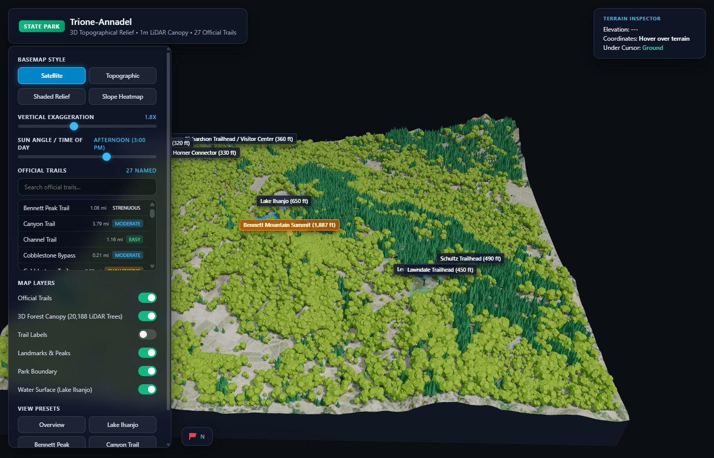

# Trione-Annadel State Park • 3D Topographical Map

> An interactive 3D topographical map and trail guide for Trione-Annadel State Park in Santa Rosa, California. Built with Three.js from 2022 USGS 3DEP LiDAR: 1 m terrain and every individual tree in the park.

### [Explore Live 3D Map](https://whaleord.github.io/annadel-3d-map/)

---

## Highlights & Features

- **Every tree in the park**: ~173,000 individual trees detected in 2022 USGS 3DEP LiDAR
  (`CA_NorthernCA_1_B22`, ~1.5 billion points), each drawn at its measured height and crown width.
  Conifer (Douglas-fir / redwood) vs broadleaf (oak / bay / madrone) comes from the Sonoma County Veg Map.
  Hover any tree to see its height and crown size.
- **1 m LiDAR terrain**: bare-earth model built from the same point cloud; the Shaded Relief and
  Topographic basemaps are baked from it at 1 m detail.
- **27 Official Trails**: OpenStreetMap trail network with distance, elevation range and climb
  (computed on the LiDAR terrain).
- **Multiple Basemap Styles**: satellite, topographic (40 ft contours), shaded relief, slope heatmap.
- **Dynamic Lighting**: time-of-day sun angle and vertical exaggeration controls.
- **Offline PWA** and mobile touch controls.

See [`pipeline/lidar/README.md`](pipeline/lidar/README.md) for how the data is built and its known limits.

---

## Project Structure

`
annadel-3d-map/
+-- index.html                 # Main web application entry point
+-- app.js                     # Three.js 3D scene, controls, trail rendering & HUD
+-- style.css                  # Dark glassmorphism UI & responsive mobile styles
+-- annadel_data.js            # Packaged bundle (LiDAR terrain, trees, trails, textures)
+-- annadel_standalone.html    # Single-file distribution (HTML + CSS + Three.js + data)
+-- manifest.json              # Web App Manifest for PWA installation
+-- sw.js                      # Offline service worker cache
+-- favicon.ico                # App icon
+-- og-preview.png             # Social share & Open Graph preview image
+-- libs/                      # Three.js r128 & OrbitControls
+-- assets/                    # Aerial & topographic texture source maps
+-- data/                      # Raw elevation, canopy & vector GeoJSON sources
+-- pipeline/lidar/            # LiDAR -> terrain + individual trees pipeline (current)
+-- *.py                       # Older data scripts (OSM trails, vegetation map)
`

---

## Local Development

To run locally:

`ash
# Using Python
python server.py
# or
python -m http.server 8089
`

Then navigate to http://localhost:8089/ in your browser.
